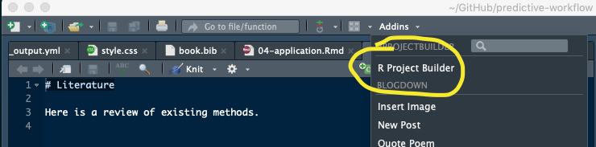

# bllFlow package

bllFlow is an R package to support the Big Life Lab approach to
develop predicitve algoirhtms. 

## Installation
```
# Install from GitHub
# 1) If not installed, install the devtools
install.packages("devtools")

# then, install the package
devtools::install_github("Big-Life-Lab/bllFlow", auth_token="ce3c2922d1da6cd42eccbc239fa5e82db15b5b17",
ref="master")
```

## Documentation

1) Package documentation in pkgdown format is [here](https://big-life-lab.github.io/bllFlow/docs).
See the [pkgdown README](pkgdown.md) for instructions about how to build and contribute to the 
pkgdown document.

2) You can see bllFlow in action [here](https://big-life-lab.github.io/bllFlow-bookdown/)
There are two reasons to use this R package.

# RStudio Plugin Installation

1. Restart the IDE
1. If the plugin was successfully installed there should be a new entry in the
   Addins menu at the top of the IDE called "R Project Builder"




The package requires a CSV file that identifies:

1. Which variable you would like transformed.
2. Which transformation you would like performed.

The CSV file (what we call the `Model Specification File (MSF`). Excute the following code to see how the MSF is organized.

`code example here to load and create a table output....`

In the same code, .....

# Plugin Usage

1. Open the web specifications CSV file for which you need to build an R project for
2. Run the plugin
3. The generated project should be in a folder called "generated-project" within the folder
   containing the web specifications file
