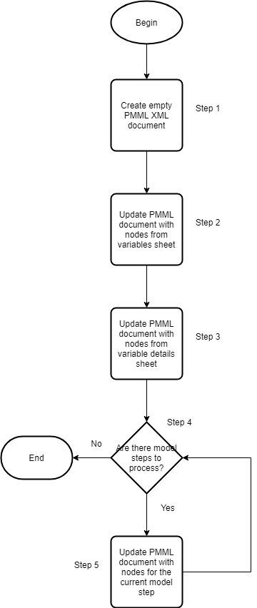

# Introduction

## Overview

This document provides the specifications for a new function `model_csv_to_pmml` that converts a set of CSV files that represents the steps to calculate the outcome of a model into PMML. 

## Glossary

# Solutions

## Design

This section will go over the different CSV files that that can be inputted into the function and the logic for converting each of them to a section in the final PMML XML file.

### Data Model

#### Model Steps File

One of three mandatory files for this function, the other two are the variable details file and the variables file. This file specifies the steps for calculating the outcome of the model as well as their order. It does not specify the data for each step which will be defined in other files defined below. The columns for this file are defined below:

1. **step**: Used to identify what step the file referenced in this row is meant for
    * **type**: enum
    * **allowable values**:
      * **dummy**: Create dummy variables
      * **center**: Center a set of variables
      * **interaction**: Create interaction terms
      * **rcs**: Create restricted cubic spline terms
      * **fine-and-gray**: Calculate the outcome of a fine and gray model
2. **fileType**: Used to identify the type of file specified in the `filePath` column. 
    * **type**: enum
    * **allowable values**:
      * **beta-coefficients**: Used to specify the beta coefficients file for a fine and gray model
      * **baseline-hazards**: Used to specify the baseline hazards file for a fine and gray model
3. **filePath**: Relative path to the file with the data for this step. The path is relative to the location of this model steps file.
    * **type**: string
4. **notes**: Used for metadata purposes
    * **type**: string
    
An example is given below

```{r}
eg_model_steps <- data.frame(
  "step" = c("dummy", "center"),
  "fileType" = c("N/A", "N/A"),
  "filePath" = c("dummy-data.csv", "../center-data.csv")
)

DT::datatable(eg_model_steps)
```
    
The above example model steps file has two steps, dummy and center, defined in the order in which they should be done. 

The file which describes the dummy step is called `dummy-data.csv` and is in the same folder as the model steps file. 

The file which describes the center step is called `center-data.csv` and is in the folder above the model steps file.

Notice how the `fileType` columns for both these steps is `N/A` or `Not Applicable`. Since the dummy and center steps require only one file to describe them, we do not need to provide a value for the `fileType` columns for those rows. The fine and gray model step described in this document required multiple files to describe it, hence requiring the use of the `fileType` column.

#### Variable Details File

One of the mandatory files. Its structure is defined here https://big-life-lab.github.io/cchsflow/articles/variable_details.html.

#### Variables File

One of the mandatory files that defines the starting variables in the model. Its columns have been defined here https://big-life-lab.github.io/cchsflow/articles/variables_sheet.html.

#### Dummy Step File

Dummying is a transformation where a categorical variable with greater than n > 2 categories, is converted to a set of n dicotomous variables. Information about how this transformation is done can be seen [here](https://en.wikiversity.org/wiki/Dummy_variable_(statistics)).

A dummy step file has the following columns:

1. **origVariable**: The name of the variable to be dummied
    * **type**: string
    * **restrictions**
      1. Each variable should be defined either in the variables or variables details sheet, or in a previous step file
2. **catValue**: The value of the category that this dummy variable will represent
    * **type**: string | number
3. **dummyVariable**: The name of the dummy variable for the category of the original variable in this row
    * **type**: string
    
An example is given below

```{r}
eg_dummy_step <- data.frame(
  "origVariable" = c("smoker_type", "smoker_type", "smoker_type", "drinker_type", "drinker_type", "drinker_type", "drinker_type"),
  "catValue" = c(0,1,2, 0,1,2,3),
  "dummyVariable" = c("non_smoker", "current_smoker", "former_smoker", "non_drinker", "current_light_drinker", "current_heavy_drinker", "former_drinker")
)

DT::datatable(eg_dummy_step)
```

The example above describes the data for dummying two variables:

* smoker_type
* drinker_type

The `smoker_type` variable has three dummy variables:

* `non_smoker`: Represents category 0 in the `smoker_type` variable
* `current_smoker`: Represents category 1 in `smoker_type` variable
* `former_smoker`: Represents category 2 in the `smoker_type` variable

The `drinker_type` variable has four dummy variables:

* `non_drinker`: Represents category 0 in the `drinker_type` variable
* `current_light_drinker`: Represents category 1 in the `drinker_type` variable
* `current_heavy_drinker`: Represents category 2 in the `drinker_type` variable
* `former_drinker`: Represents category 3 in the `drinker_type` variable

#### Centering Step File

Centering is a transformation where the original variable is subtracted by a value, usually it's mean or median. The centering step file consists of the following columns:

1. **origVariable**: The name of the variable being centered
    * **type**: string
    * **restrictions**
      1. Each variable should be defined either in the variables or variables details sheet, or in a previous step file
2. **centerValue**: The value to center the variable with
    * **type**: number
3. **centeredVariable**: The name of the new centered variable
    * **type**: string
    
An example is given below,

```{r}
eg_centering_step <- data.frame(
  "origVariable" = c("age", "diet_score"),
  "centerValue" = c(40, 4),
  "centeredVariable" = c("age_C", "diet_score_C")
)

DT::datatable(eg_centering_step)
```

The example above describes the data for centering two variables, `age` and `diet_score`

The values used to center the two variables are `40` and `4` respectively

The names of the new centered variables are `age_C` and `diet_score_C`

#### Restricted Cubic Spline (RCS) Step File

An RCS step file has the following columns:

1. **variable**: The name of the variable that should be splined
    * **type**: string
    * **restrictions**
      1. Each variable should be defined either in the variables or variables details sheet, or in a previous step file
2. **rcsVariables**: The names of the new spline variables. The name of each variable should be seperated by a semi-colon (;)
    * **type**: string
3. **knots**: The knots for this spline. Each know should be seperated by a semi-colon (;)
    * **type**: string
    
An example is given below,

```{r}
eg_rcs_step <- data.frame(
  "variable" = c("Age_c", "PackYears_c"),
  "rcsVariables" = c("AgeC_rcs1;AgeC_rcs2;AgeC_rcs3;AgeC_rcs4", "PackYearsC_rcs1;PackYearsC_rcs2"),
  "knots" = c("-11.5;-6.5;-1.5;5.5;16.5", "-21.2;-10.35;34.8")
)

DT::datatable(eg_rcs_step)
```

The example describes the data for creating new spline variable for two variables, `Age_c` and `PackYears_c`

For `Age_c`, a 5 knot spline is used and 4 new spline variables are created. The knots given are,

1. -11.5
2. -6.5
3. -1.5
4. 5.5
5. 16.5

The new variables created are,

1. AgeC_rcs1
2. AgeC_rcs2
3. AgeC_rcs3
4. AgeC_rcs4

Notice how in the CSV, each knot is seperated by a ";" and each new variable name is also seperated by a ";"

Similarly, for `PackYears_c`, we define a 3 knot spline where the knots are `-21.2`, `-10.35` and `34.8`. The new spline variables are `PackYearsC_rcs1` and `PackYearsC_rcs2`.

#### Interaction Step File

Theoretically, an interaction variable is created to model effect modification. Effect modification takes place when a risk factor modifies the effect that another risk factor has on a condition. An example is age, cancer and their effect on mortality, where as you get older the effect that cancer has on your risk of mortality increases. Here, age is said to modify the effect that cancer has on mortality. Mathematically, an effect modification is modeled by creating a new variable whose value is the product of the two "interacting" variables, for eg, age and cancer.

An interaction step file has the following columns:

1. **interactingVariables**: The names of the interacting variables seperated by a semi-colon (;)
    * **type**: string
    * **restrictions**
      1. Each interacting variable should be defined either in the variables or variables details sheet, or in a previous step file
2. **interactionVariable**: The name of the new interaction variable
    * **type**: string
    
An example is given below,

```{r}
eg_interaction_step <- data.frame(
  "interactionVariable" = c("AgeXCancer", "AgeXHypertension"),
  "interactingVariables" = c("Age;Cancer", "Age;Hypertension")
)

DT::datatable(eg_interaction_step)
```

The example above creates two new interaction variables, `AgeXCancer` and `AgeXHypertension`. `AgeXCancer` is created using the `Age` and `Cancer` variables while `AgeXHypertension` is created using the `Age` and `Hypertension` variables. Notice how the interacting variables are seperated by a semi-colon in the example.

#### Fine and Gray Model Step Files

Similar to a cox regression model, a fine and gray model estimates the risk of an event occuring at some time in the future, the difference being that it takes competing risks into account. Specifying this step requires two files,

1. A beta coefficients file which specifies the names of the covariates in the model and their beta coefficient
2. A baseline hazards file which specifies a time value and the baseline hazard value associated with it

The beta coefficients file has the following columns:

1. **variable**: The name of a covariate in the model
    **type**: string
    * **restrictions**
      1. Each variable should be defined either in the variables or variables details sheet, or in a previous step file
2. **coefficient**: The value of the beta coefficient for the covariate
    **type**: number
    
The baseline hazards file has the following columns:

1. **time**: The time value 
    **type**: number
2. **baselineHazard**: The baseline hazard value for this time
    **type**: number
    
When adding a fine and gray model step, make sure to add a variable in the variable details sheet called time. This variable represents the time interval when the model is valid. It should be a continuous variable whose `recTo` values represents the time interval. It's `units` column should specify the time metric being used for example `years`. For example, a model that can predict risk at any point in time between 1 year and 5 years from today would have the following entry in the variable details sheet,

```{r}
eg_time_variable <- data.frame(
  "variable" = c("time", "time"),
  "recTo" = c(1, 5),
  "catLabel" = c("Start Time", "End Time"),
  "catLabelLong" = c("Start Time", "End Time"),
  "units" = c("years", "years")
)

DT::datatable(eg_time_variable)
```

The values of the other columns in the variable details sheet for this variable should be `N/A`.

An example model steps file and the referenced fine and gray model files are shown below.

```{r}
eg_fine_and_gray_model_steps_file <- data.frame(
  "step" = c("fine-and-gray", "fine-and-gray"),
  "fileType" = c("beta-coefficients", "baseline-hazards"),
  "filePath" = c("beta-coefficients.csv", "baseline-hazards.csv")
)
DT::datatable(eg_fine_and_gray_model_steps_file)

eg_beta_coefficients_csv <- data.frame(
  "variable" = c("Age", "Sex"),
  "coefficient" = c(0.01, 2)
)
DT::datatable(eg_beta_coefficients_csv)

eg_baseline_hazards_csv <- data.frame(
  "time" = c(1, 2, 3, 4, 5),
  "baselineHazard" = c(0.1, 0.2, 0.3, 0.4, 0.5)
)
DT::datatable(eg_baseline_hazards_csv)
```

The model steps file has 2 rows, both of which are a fine and gray step. The type of file described in each row is is given by `fileType` column. The first row references the a beta coefficients file and the second row references a baseline hazards file. The path to each file is given in the `filePath` column and once again should be relative to the model steps file that described them.

The beta coefficients file says that the model has two covariates, `Age` and `Sex` and specifies the beta coefficients for each one which are `0.01` and `2` respectively.

The baseline hazards has 5 rows and describes the baseline hazards for each year in the model. Notice how the lowest time value is `1` and the highest value is `5`. This is because of the time variable we specified earlier which goes from 1 to 5.

### Business Logic

This section will go through the logic for transforming a set of model CSV files into PMML. The flowchart below broadly outlines the steps. The next few section will go through each step in the flow chart in detail.



#### Step 1

This step creates an empty PMML document to which we will add the relevant nodes in the subsequent steps. The empty PMML document has the following XML,

```{xml}
<?xml version="1.0"?>
<PMML version="4.4"
  xmlns="http://www.dmg.org/PMML-4_4" 
  xmlns:xsi="http://www.w3.org/2001/XMLSchema-instance">
  <Header>
    <Application name="bllflow" version="0.1.0"/>
  </Header>
</PMML>
```

Things to note:

* The `version` attribute for the `Application` element is set to the version of the bllflow package creating this document

#### Step 2

#### Step 3

#### Step 4

Go through the rows in the model steps file until we have processed all of them. The next step will go through how to add the data for each model step into the PMML document.

#### Step 5

Add the data for each model step into the PMML document. The child sections below will go through the nodes to add for each model step.

##### Dummy Step

We will be using the example we provided when explaining the data model for this step.

For each set of new dummy variables created for an original variable, we need to add a number of `DerivedField` nodes to the `LocalTransformations` node within the `PMML` node. Using the example dummy step CSV file above, the PMML document would look like,

```{xml}
<?xml version="1.0"?>
<PMML version="4.4"
  xmlns="http://www.dmg.org/PMML-4_4" 
  xmlns:xsi="http://www.w3.org/2001/XMLSchema-instance">
  <Header>
    <Application name="bllflow" version="0.1.0"/>
  </Header>
  <TransformationDictionary>
    
    <!--These are the derived field nodes added for each dummy variable for the
    non-smoker variable-->
      
    <DerivedField name="non_smoker" optype="categorical" dataType="integer">
      <Apply function="if">
        <FieldRef field="smoker_type" />
        <Constant dataType="float">0</Constant>
      </Apply>
      <Constant dataType="float">1</Constant>
      <Constant dataType="float">0</Constant>
    </DerivedField>
      
    <DerivedField name="current_smoker" optype="categorical" dataType="integer">
      <Apply function="if">
        <FieldRef field="smoker_type" />
        <Constant dataType="float">1</Constant>
      </Apply>
      <Constant dataType="float">1</Constant>
      <Constant dataType="float">0</Constant>
    </DerivedField>
      
    <DerivedField name="former_smoker" optype="categorical" dataType="integer">
      <Apply function="if">
        <FieldRef field="smoker_type" />
        <Constant dataType="float">2</Constant>
      </Apply>
      <Constant dataType="float">1</Constant>
      <Constant dataType="float">0</Constant>
    </DerivedField>
      
    <!--These are the derived field nodes added for each dummy variable for the
    drinker-type variable-->
      
    <DerivedField name="non_drinker" optype="categorical" dataType="integer">
      <Apply function="if">
        <FieldRef field="drinker_type" />
        <Constant dataType="float">0</Constant>
      </Apply>
      <Constant dataType="float">1</Constant>
      <Constant dataType="float">0</Constant>
    </DerivedField>
      
    <DerivedField name="current_light_drinker" optype="categorical" dataType="integer">
      <Apply function="if">
        <FieldRef field="drinker_type" />
        <Constant dataType="float">1</Constant>
      </Apply>
      <Constant dataType="float">1</Constant>
      <Constant dataType="float">0</Constant>
    </DerivedField>
      
    <DerivedField name="drinker_type" optype="categorical" dataType="integer">
      <Apply function="if">
        <FieldRef field="current_heavy_drinker" />
        <Constant dataType="float">2</Constant>
      </Apply>
      <Constant dataType="float">1</Constant>
      <Constant dataType="float">0</Constant>
    </DerivedField>
      
    <DerivedField name="drinker_type" optype="categorical" dataType="integer">
      <Apply function="if">
        <FieldRef field="former_drinker" />
        <Constant dataType="float">3</Constant>
      </Apply>
      <Constant dataType="float">1</Constant>
      <Constant dataType="float">0</Constant>
    </DerivedField>
      
  </TransformationDictionary>
</PMML>
```

Things to note:

* The number of `DerivedField` nodes should equal the number of rows in the dummy step file
* The value of each attribute in the `DerivedField` node are:
    * The `name` attribute should be set to the value of the `dummyVariable` column for that row
    * The `optype` attribute should be set to `categorical`
    * The `dataType` attribute should be set to `integer`
* The nodes within each `DerivedField` nodes describes how to convert each original variable to the dummy variable for that row. For example, the nodes for the `non_smoker` dummy variable are set to represent the code,

```{r, eval = FALSE}
if(smoker_type == 0) { # The value of 0 comes from the catValue column for the non_smoker row
  non_smoker <- 1 # If the original variable value (smoker_type) is equal to the catValue column (1)
                  # then set the dummy variable (non_smoker) to 1
} else {
  non_smoker <- 0 # Otherwise set the dummy variable value to 0
}
```

* The above code is replicated for each row in the dummy step file


