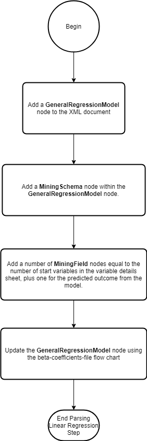

# Introduction

## Overview

This document provides the specifications for a new function `model_csv_to_pmml` that converts a set of CSV files (that represent the steps to calculate the outcome of a model) into PMML. 

## Glossary

# User Files

This section will go over the different CSV files that the user needs to provide.

## Model Exports File

One of the four mandatory files that the user has to provide. Each row in this CSV file gives the location of a file needed for implementation. The metadata for this file is given below:

```{r echo=FALSE}
model_exports_file_metadata <- data.frame(
  fileType = c("model exports", "model exports"),
  columnName = c("fileType", "filePath"),
  columnType = c("enum", "string"),
  description = c(
    "Used to identify what file this row is referring to",
    "The relative path to this file. The path should be relative to the location of the model export file"
  ),
  enumValues = c(
    "variables;<br/>
    variable-details;<br/>
    model-steps", 
    "N/A"
  ),
  enumLabels = c(
    "Value for the variables sheet. There has to be an entry in this file with this value; <br/> 
    Value for the variable details sheet. There has to be an entry in this file with this value; <br/> 
    Value for the model steps sheet. There has to be an entry in this file with this value",
    ""
  ),
  restrictions = c(
    "mandatory", 
    "mandatory"
  )
)

DT::datatable(model_exports_file_metadata, escape = FALSE)
```
        
An example is provided below

```{r echo=FALSE}
model_export_file <- data.frame(
  fileType = c("variables", "variable-details", "model-steps"),
  filePath = c("./variables.csv", "../../variable-details.csv", "./model-steps.csv")
)

DT::datatable(model_export_file)
```

Going into more details,

* The first row gives the location of the variables file. It's located in the same folder as the model export file and is called `variables.csv`
* The second row gives the location of the variable details file. It's located two folders above the model export file and is called `variable-details.csv`
* The third row gives the location of the model steps file. It's located in the same folder as the model export file and is called `model-steps.csv`

## Model Steps File

One of three mandatory files for this function, the other two are the variable details file and the variables file. This file specifies the steps for calculating the outcome of the model as well as their order. It does not specify the data for each step which will be defined in other files below. The metadata for this file is:

```{r echo=FALSE}
model_steps_file_metadata <- data.frame(
  fileType = c("model steps", "model steps", "model steps", "model steps"),
  columnName = c("step", "fileType", "filePath", "notes"),
  columnType = c("enum", "enum", "string", "string"),
  description = c(
    "Used to identify what step the file referenced in this row is meant for",
    "Used to identify the type of file specified in the `filePath` column",
    "Relative path to the file with the data for this step. The path is relative to the location of this model steps file",
    "Used for metadata purposes"
  ),
  enumValues = c(
    "dummy; <br/>
    center; <br/>
    interaction; <br/>
    rcs; <br/>
    fine-and-gray; <br/>
    linear-regression;",
    
    "beta-coefficients; <br/>
    baseline-hazards; <br/>",
    
    "N/A",
    
    "N/A"
  ),
  enumLabels = c(
    "Create dummy variables; <br/>
    Center a set of variables; <br/>
    Create interaction terms; <br/>
    Create restricted cubic spline terms; <br/>
    Calculate the outcome of a fine and gray model; <br/>
    Calculate the outcome of a linear regression model; <br />",
    
    "Used to specify the beta coefficients file for a fine and gray step; <br/>
    Used to specify the baseline hazards file for a fine and gray step; <br />",
    
    "N/A",
    
    "N/A"
  ),
  restrictions = c("mandatory", "", "mandatory", "")
)

DT::datatable(model_steps_file_metadata, escape = FALSE)
```
    
An example is given below

```{r echo=FALSE}
eg_model_steps <- data.frame(
  "step" = c("dummy", "center"),
  "fileType" = c("N/A", "N/A"),
  "filePath" = c("dummy-data.csv", "../center-data.csv")
)

DT::datatable(eg_model_steps)
```
    
The above example model steps file has two steps, dummy and center, defined in the order in which they should be done. 

The file which describes the dummy step is called `dummy-data.csv` and is in the same folder as the model steps file. 

The file which describes the center step is called `center-data.csv` and is in the folder above the model steps file.

Notice how the `fileType` columns for both these steps is `N/A` or `Not Applicable`. Since the dummy and center steps require only one file to describe them, we do not need to provide a value for the `fileType` columns for those rows. The fine and gray model step described in this document required multiple files to describe it, hence requiring the use of the `fileType` column.

## Variable Details File

One of the mandatory files. Its structure is defined here https://big-life-lab.github.io/cchsflow/articles/variable_details.html.

## Variables File

One of the mandatory files that defines the starting variables in the model. Its columns have been defined here https://big-life-lab.github.io/cchsflow/articles/variables_sheet.html.

## Dummy Step File

Dummying is a transformation where a categorical variable with greater than n > 2 categories, is converted to a set of n dicotomous variables. Information about how this transformation is done can be seen [here](https://en.wikiversity.org/wiki/Dummy_variable_(statistics)).

The metadata for this file is provided below:

```{r echo=FALSE}
dummy_step_file_metadata <- data.frame(
  fileType = c("dummy step", "dummy step", "dummy step"),
  columnName = c("origVariable", "catValue", "dummyVariable"),
  columnType = c("string", "string | number", "string"),
  description = c(
    "The name of the variable to be dummied",
    "The value of the category that this dummy variable will represent",
    "The name of the dummy variable for the category of the original variable in this row"
  ),
  enumValues = c(
    "N/A",
    "N/A",
    "N/A"
  ),
  enumLabels = c(
    "N/A",
    "N/A",
    "N/A"
  ),
  restrictions = c(
    "Each variable should be defined either in the variables or variables details sheet, or in a previous step file", 
    "mandatory", 
    "mandatory"
  )
)

DT::datatable(dummy_step_file_metadata, escape = FALSE)
```
    
An example is given below

```{r echo=FALSE}
eg_dummy_step <- data.frame(
  "origVariable" = c("smoker_type", "smoker_type", "smoker_type", "drinker_type", "drinker_type", "drinker_type", "drinker_type"),
  "catValue" = c(0,1,2, 0,1,2,3),
  "dummyVariable" = c("non_smoker", "current_smoker", "former_smoker", "non_drinker", "current_light_drinker", "current_heavy_drinker", "former_drinker")
)

DT::datatable(eg_dummy_step)
```

The example above describes the data for dummying two variables:

* smoker_type
* drinker_type

The `smoker_type` variable has three dummy variables:

* `non_smoker`: Represents category 0 in the `smoker_type` variable
* `current_smoker`: Represents category 1 in `smoker_type` variable
* `former_smoker`: Represents category 2 in the `smoker_type` variable

The `drinker_type` variable has four dummy variables:

* `non_drinker`: Represents category 0 in the `drinker_type` variable
* `current_light_drinker`: Represents category 1 in the `drinker_type` variable
* `current_heavy_drinker`: Represents category 2 in the `drinker_type` variable
* `former_drinker`: Represents category 3 in the `drinker_type` variable

## Centering Step File

Centering is a transformation where the original variable is subtracted by a value, usually it's mean or median. The metadata for this file is given below:

```{r echo=FALSE}
center_step_file_metadata <- data.frame(
  fileType = c("center step", "center step", "center step", "center step"),
  columnName = c("origVariable", "centerValue", "centeredVariable", "centeredVariableType"),
  columnType = c("string", "number", "string", "enum"),
  description = c(
    "The name of the variable being centered",
    "The value to center the variable with",
    "The name of the new centered variable",
    "Type of the new centered variable"
  ),
  enumValues = c(
    "N/A",
    "N/A",
    "N/A",
    "cat; <br/>
    cont"
  ),
  enumLabels = c(
    "N/A",
    "N/A",
    "N/A",
    "Categorical; <br/>
    Continuous"
  ),
  restrictions = c(
    "Each variable should be defined either in the variables or variables details sheet, or in a previous step file", 
    "mandatory", 
    "mandatory",
    "mandatory"
  )
)

DT::datatable(center_step_file_metadata, escape = FALSE)
```
    
An example is given below,

```{r echo=FALSE}
eg_centering_step <- data.frame(
  "origVariable" = c("age", "diet_score"),
  "centerValue" = c(40, 4),
  "centeredVariable" = c("age_C", "diet_score_C"),
  "centeredVariableType" = c("cont", "cont")
)

DT::datatable(eg_centering_step)
```

The example above describes the data for centering two variables, `age` and `diet_score`

The values used to center the two variables are `40` and `4` respectively

The names of the new centered variables are `age_C` and `diet_score_C` and they are both continuous

## Restricted Cubic Spline (RCS) Step File

The metadata for this file is given below:

```{r echo=FALSE}
rcs_step_file_metadata <- data.frame(
  fileType = c("rcs step", "rcs step", "rcs step"),
  columnName = c("variable", "rcsVariable", "knots"),
  columnType = c("string", "string", "string"),
  description = c(
    "The name of the variable that should be splined",
    "The names of the new spline variables. The name of each variable should be seperated by a semi-colon (;)",
    "The knots for this spline. Each knot should be seperated by a semi-colon (;)"
  ),
  enumValues = c(
    "N/A",
    "N/A",
    "N/A"
  ),
  enumLabels = c(
    "N/A",
    "N/A",
    "N/A"
  ),
  restrictions = c(
    "Each variable should be defined either in the variables or variables details sheet, or in a previous step file", 
    "mandatory", 
    "mandatory"
  )
)

DT::datatable(rcs_step_file_metadata, escape = FALSE)
```
    
An example is given below,

```{r echo=FALSE}
eg_rcs_step <- data.frame(
  "variable" = c("Age_c", "PackYears_c"),
  "rcsVariables" = c("AgeC_rcs1;AgeC_rcs2;AgeC_rcs3;AgeC_rcs4", "PackYearsC_rcs1;PackYearsC_rcs2"),
  "knots" = c("-11.5;-6.5;-1.5;5.5;16.5", "-21.2;-10.35;34.8")
)

DT::datatable(eg_rcs_step)
```

The example describes the data for creating new spline variable for two variables, `Age_c` and `PackYears_c`

For `Age_c`, a 5 knot spline is used and 4 new spline variables are created. The knots given are,

1. -11.5
2. -6.5
3. -1.5
4. 5.5
5. 16.5

The new variables created are,

1. AgeC_rcs1
2. AgeC_rcs2
3. AgeC_rcs3
4. AgeC_rcs4

Notice how in the CSV, each knot is seperated by a ";" and each new variable name is also seperated by a ";"

Similarly, for `PackYears_c`, we define a 3 knot spline where the knots are `-21.2`, `-10.35` and `34.8`. The new spline variables are `PackYearsC_rcs1` and `PackYearsC_rcs2`.

## Interaction Step File

Theoretically, an interaction variable is created to model effect modification. Effect modification occurs when the magnitude of the effect of a risk factor on a outcome differs depending on another risk factor. An example is age, cancer and their effect on mortality, where as you get older the effect that cancer has on your risk of mortality increases. Here, age is said to modify the effect that cancer has on mortality. Mathematically, an effect modification is modeled by creating a new variable whose value is the product of the two "interacting" variables, e.g., age and cancer.

The metadata for this file is given below:

```{r echo=FALSE}
interaction_step_file_metadata <- data.frame(
  fileType = c("interaction step", "interaction step", "interaction step"),
  columnName = c("interactingVariables", "interactionVariable", "interactionVariableType"),
  columnType = c("string", "string", "string"),
  description = c(
    "The names of the interacting variables seperated by a semi-colon (;)",
    "The name of the new interaction variable",
    "The type of the new interaction variable"
  ),
  enumValues = c(
    "N/A",
    "N/A",
    "N/A"
  ),
  enumLabels = c(
    "N/A",
    "N/A",
    "N/A"
  ),
  restrictions = c(
    "mandatory; <br/>
    Each interacting variable should be defined either in the variables or variable details sheet, or in a previous step file", 
    "mandatory", 
    "mandatory"
  )
)

DT::datatable(interaction_step_file_metadata, escape = FALSE)
```
    
An example is given below,

```{r echo=FALSE}
eg_interaction_step <- data.frame(
  "interactionVariable" = c("AgeXCancer", "AgeXHypertension"),
  "interactingVariables" = c("Age;Cancer", "Age;Hypertension"),
  "interactionVariableType" = c("cont", "cont")
)

DT::datatable(eg_interaction_step)
```

The example above creates two new interaction variables, `AgeXCancer` and `AgeXHypertension`. `AgeXCancer` is created using the `Age` and `Cancer` variables while `AgeXHypertension` is created using the `Age` and `Hypertension` variables. Both new interaction variables are continuous. Notice how the interacting variables are seperated by a semi-colon in the example.

```{r}
beta_coefficients_step_file_metadata <- data.frame(
  fileType = c("beta coefficients step", "beta coefficients step", "beta coefficients step"),
  columnName = c("variable", "coefficient", "type"),
  columnType = c("string", "number", "enum"),
  description = c(
    "The name of a covariate in the model",
    "The value of the beta coefficient for the covariate",
    "The type of the covariate"
  ),
  enumValues = c(
    "N/A",
    "N/A",
    "cat; <br/>
    cont"
  ),
  enumLabels = c(
    "N/A",
    "N/A",
    "Categorical; <br/>
    Continuous;"
  ),
  restrictions = c(
    "mandatory; <br/>
    Each variable should be defined either in the variables or variables details sheet, or in a previous step file", 
    "mandatory", 
    "mandatory"
  )
)
```

## Fine and Gray Model Step Files

Similar to a cox regression model, a fine and gray model estimates the risk of an event occuring at some time in the future, the difference being that it takes competing risks into account. Specifying this step requires two files,

1. A beta coefficients file which specifies the names of the covariates in the model and their beta coefficient
2. A baseline hazards file which specifies a time value and the baseline hazard value associated with it

The metadata for the beta coefficients file is given below:

```{r echo=FALSE}
DT::datatable(beta_coefficients_step_file_metadata, escape = FALSE)
```
    
The metadata for the baseline hazards file is given below:

```{r echo=FALSE}
baseline_hazards_step_file_metadata <- data.frame(
  fileType = c("baseline hazards step", "baseline hazards step"),
  columnName = c("time", "baselineHazard"),
  columnType = c("string", "number"),
  description = c(
    "The time upto which this baseline hazard should be used",
    "The baseline hazard value for this time"
  ),
  enumValues = c(
    "N/A",
    "N/A"
  ),
  enumLabels = c(
    "N/A",
    "N/A"
  ),
  restrictions = c(
    "mandatory", 
    "mandatory"
  )
)

DT::datatable(baseline_hazards_step_file_metadata, escape = FALSE)
```

The baseline hazards file has the following columns:

1. **time**: The time upto which this baseline hazard should be used
    **type**: number
2. **baselineHazard**: The baseline hazard value for this time
    **type**: number
    
When adding a fine and gray model step, make sure to add a variable in the variable details sheet called time. This variable represents the time interval when the model is valid. It should be a continuous variable whose `recTo` values represents the time interval. It's `units` column should specify the time metric being used for example `years`. For example, a model that can predict risk at any point in time between 1 year and 5 years from today would have the following entry in the variable details sheet,

```{r echo=FALSE}
eg_time_variable <- data.frame(
  "variable" = c("time", "time"),
  "recTo" = c(1, 5),
  "catLabel" = c("Start Time", "End Time"),
  "catLabelLong" = c("Start Time", "End Time"),
  "units" = c("years", "years")
)

DT::datatable(eg_time_variable)
```

The values of the other columns in the variable details sheet for this variable should be `N/A`.

An example model steps file and the referenced fine and gray model files are shown below.

```{r echo=FALSE}
eg_fine_and_gray_model_steps_file <- data.frame(
  "step" = c("fine-and-gray", "fine-and-gray"),
  "fileType" = c("beta-coefficients", "baseline-hazards"),
  "filePath" = c("beta-coefficients.csv", "baseline-hazards.csv")
)
DT::datatable(eg_fine_and_gray_model_steps_file)

eg_beta_coefficients_csv <- data.frame(
  "variable" = c("Age", "Sex"),
  "coefficient" = c(0.01, 2)
)
DT::datatable(eg_beta_coefficients_csv)

eg_baseline_hazards_csv <- data.frame(
  "time" = c(1, 2, 3, 4, 5),
  "baselineHazard" = c(0.1, 0.2, 0.3, 0.4, 0.5)
)
DT::datatable(eg_baseline_hazards_csv)
```

The model steps file has 2 rows, both of which are a fine and gray step. The type of file described in each row is is given by `fileType` column. The first row references the a beta coefficients file and the second row references a baseline hazards file. The path to each file is given in the `filePath` column and once again should be relative to the model steps file that described them.

The beta coefficients file says that the model has two covariates, `Age` and `Sex` and specifies the beta coefficients for each one which are `0.01` and `2` respectively.

The baseline hazards has 5 rows and describes the baseline hazards for each year in the model. Notice how the lowest time value is `1` and the highest value is `5`. This is because of the time variable we specified earlier which goes from 1 to 5.

## Linear Regression Model

A linear regression model is used to predict a continuous outcome from a set of covariates. Adding this step requires a beta coefficients file which specifies the names of the covariates in the model and their beta coefficient value. The metadata for the beta coefficients file is given below:

```{r echo=FALSE}
DT::datatable(beta_coefficients_step_file_metadata, escape = FALSE)
```

An example model steps file with a linear regression step are shown below are shown below.

```{r echo=FALSE}
eg_linear_regression_model_steps_file <- data.frame(
  "step" = c("linear-regression"),
  "fileType" = c("N/A"),
  "filePath" = c("beta-coefficients.csv")
)
DT::datatable(eg_linear_regression_model_steps_file)

eg_beta_coefficients_csv <- data.frame(
  "variable" = c("Age", "Sex"),
  "coefficient" = c(0.01, 2)
)
DT::datatable(eg_beta_coefficients_csv)
```

The model steps file has a single row for a step to calculate the outcome of a linear regression model. Since this step requires only one file to fully specify it, we can enter in a value of `N/A` in the `fileType` column. The `filePath` column has the path to the file with the covariates and the beta coefficients for the model. Once again the paths should be relative to the model steps file that described them.

The beta coefficients file says that the model has two covariates, `Age` and `Sex` and specifies the beta coefficients for each one which are `0.01` and `2` respectively.

# Business Logic

This section will go through the logic for transforming a set of model CSV files into PMML. The flowchart below broadly outlines the steps. The next few section will go through each step in the flow chart in detail.


## Step 1

This step will parse the rows in the model export CSV file

## Step 2

This step creates an empty PMML document to which we will add the relevant nodes in the subsequent steps. The empty PMML document has the following XML,

```{xml}
<?xml version="1.0"?>
<PMML version="4.4"
  xmlns="http://www.dmg.org/PMML-4_4" 
  xmlns:xsi="http://www.w3.org/2001/XMLSchema-instance">
  <Header>
    <Application name="bllflow" version="0.1.0"/>
  </Header>
</PMML>
```

Things to note:

* The `version` attribute for the `Application` element is set to the version of the bllflow package creating this document

## Steps 3 and 4

Use the `recodeflow::recode_to_pmml` function to do this. The arguments for this function are as follows:

* `var_details_sheet`: Pass in the sheet passed into this function
* `vars_sheet`: Pass in the sheet passed into this function
* `db_name`: Pass in the value passed into this function
* `vars_to_convert`: NULL

## Step 5

Go through the rows in the model steps file until we have processed all of them. The next step will go through how to add the data for each model step into the PMML document.

## Step 6

Add the data for each model step into the PMML document. The child sections below will go through the nodes to add for each model step.

### Dummy Step

We will be using the example we provided when explaining the data model for this step.

For each set of new dummy variables created for an original variable, we need to add a number of `DerivedField` nodes to the `TransformationDictionary` node within the `PMML` node. Using the example dummy step CSV file above, the PMML document would look like,

```{xml}
<?xml version="1.0"?>
<PMML version="4.4"
  xmlns="http://www.dmg.org/PMML-4_4" 
  xmlns:xsi="http://www.w3.org/2001/XMLSchema-instance">
  <Header>
    <Application name="bllflow" version="0.1.0"/>
  </Header>
  <TransformationDictionary>
    
    <!--These are the derived field nodes added for each dummy variable for the
    non-smoker variable-->
      
    <DerivedField name="non_smoker" optype="categorical" dataType="float">
      <Apply function="if">
        <Apply function="equals">
          <FieldRef field="smoker_type" />
          <Constant dataType="float">0</Constant>
        </Apply>
        <Constant dataType="float">1</Constant>
        <Constant dataType="float">0</Constant>
      </Apply>
    </DerivedField>
      
    <DerivedField name="current_smoker" optype="categorical" dataType="float">
      <Apply function="if">
        <Apply function="equals">
          <FieldRef field="smoker_type" />
          <Constant dataType="float">1</Constant>
        </Apply>
        <Constant dataType="float">1</Constant>
        <Constant dataType="float">0</Constant>
      </Apply>
    </DerivedField>
      
    <DerivedField name="former_smoker" optype="categorical" dataType="float">
      <Apply function="if">
        <Apply function="equals">
          <FieldRef field="smoker_type" />
          <Constant dataType="float">2</Constant>
        </Apply>
        <Constant dataType="float">1</Constant>
        <Constant dataType="float">0</Constant>
      </Apply>
    </DerivedField>
      
    <!--These are the derived field nodes added for each dummy variable for the
    drinker-type variable-->
      
    <DerivedField name="non_drinker" optype="categorical" dataType="float">
      <Apply function="if">
        <Apply function="equals">
          <FieldRef field="drinker_type" />
          <Constant dataType="float">0</Constant>
        </Apply>
        <Constant dataType="float">1</Constant>
        <Constant dataType="float">0</Constant>
      </Apply>
    </DerivedField>
      
    <DerivedField name="current_light_drinker" optype="categorical" dataType="float">
      <Apply function="if">
        <Apply function="equals">
          <FieldRef field="drinker_type" />
          <Constant dataType="float">1</Constant>
        </Apply>
        <Constant dataType="float">1</Constant>
        <Constant dataType="float">0</Constant>
      </Apply>
    </DerivedField>
      
    <DerivedField name="drinker_type" optype="categorical" dataType="float">
      <Apply function="if">
        <Apply function="equals">
          <FieldRef field="current_heavy_drinker" />
          <Constant dataType="float">2</Constant>
        </Apply>
        <Constant dataType="float">1</Constant>
        <Constant dataType="float">0</Constant>
      </Apply>
    </DerivedField>
      
    <DerivedField name="drinker_type" optype="categorical" dataType="float">
      <Apply function="if">
        <Apply function="equals">
          <FieldRef field="former_drinker" />
          <Constant dataType="float">3</Constant>
        </Apply>
        <Constant dataType="float">1</Constant>
        <Constant dataType="float">0</Constant>
      </Apply>
    </DerivedField>
      
  </TransformationDictionary>
</PMML>
```

Things to note:

* The number of `DerivedField` nodes should equal the number of rows in the dummy step file
* The value of each attribute in the `DerivedField` node are:
    * The `name` attribute should be set to the value of the `dummyVariable` column for that row
    * The `optype` attribute should be set to `categorical`
    * The `dataType` attribute should be set to `integer`
* The nodes within each `DerivedField` nodes describes how to convert each original variable to the dummy variable for that row. For example, the nodes for the `non_smoker` dummy variable are set to represent the code,

```{r, eval = FALSE}
if(smoker_type == 0) { # The value of 0 comes from the catValue column for the non_smoker row
  non_smoker <- 1 # If the original variable value (smoker_type) is equal to the catValue column (1)
                  # then set the dummy variable (non_smoker) to 1
} else {
  non_smoker <- 0 # Otherwise set the dummy variable value to 0
}
```

* The above code is replicated for each row in the dummy step file

### Centering Step

We will be using the example used to describe this CSV file here.

For each new centered variable defined in the CSV file, we have to add a `DerivedField` node to the `TransformationDictionary` node within the `PMML` node. 

The nodes within the `DerivedField` node should represent the R code shown below,

```{r eval=FALSE}
# The R code for the row with the age_C variable
age_C <- age - 40

# The R code for the row with the diet_score_C variable
diet_score_C <- diet_score - 4
```

And finally the XML nodes that needs to be added to the `TransformationDictionary` node looks like,

```{xml}
<!-- The XML for the age_C variable-->
<DerivedField name="age_C" optype="continuous" dataType="float">
  <Apply function="-">
    <FieldRef field="age" />
    <Constant dataType="float">40</Constant>
  </Apply>
</DerivedField>

<!-- The XML for the diet_score_C variable-->  
<DerivedField name="diet_score_C" optype="continuous" dataType="float">
  <Apply function="-">
    <FieldRef field="diet_score" />
    <Constant dataType="float">4</Constant>
  </Apply>
</DerivedField>
```

Things to note:

1. For each new centered variable defined in the CSV file (i.e. for each new row), a `DerivedField` field node needs to be added to the `TransformationDictionary` node within the `PMML` node
2. The `name` attribute for the `DerivedField` node should be the value of the `centeredVariable` column for that row
3. The `optype` attribute for the `DerivedField` node should be `continuous` if the `centeredVariableType` column value is `cont` or `categorical` if the value is `cat`
4. The `dataType` attribute for the `DerivedField` node should be `string` if the `centeredVariableType` column value is `cat` and `float` if the value is `cont`
5. The value of the `field` attribute for the `FieldRef` should be the value of the `origVariabvle` column for that row
6. The value within the `Constant` node should the the value of the `centerValue` column for that row

### RCS Step

Converting an RCS step file to PMML involves adding `DerivedField` nodes to the `TransformationDictionary` node within the `PMML` node. Things to note:

1. For each new RCS variable creates in each row of the file, we need to add a new `DerivedField` node
2. The `name` attribute for the `DerivedField` node is the name of the RCS variable it's for
3. The `optype` attribute for the `DerivedField` node should be set to `continuous`
4. The `dataType` attribute for `DerivedField` should be set to `float`
5. For the first RCS variable in each row, the contents of the `DerivedField` node should just set it to the variable in the `variable` column
6. For the other RCS variables, the contents of each `DerivedField` node should call a function called `rcs` whose signature looks like,

```{r eval=FALSE}
# first_rcs_variable: The value in the first rcs variable
# knot_number: Which rcs variable this is
# knots: The array of knots
rcs <- function(previous_rcs_variable, knot_number, knots) {
  
}
```

The example CSV file used to describe this step above would be converted to the following nodes

```{xml}
<!-- The new derived field nodes for the first row -->
<DerivedField name="AgeC_rcs1" optype="continuous" dataType="float">
  <FieldRef field="Age_c" />
</DerivedField>
  
<DerivedField name="AgeC_rcs2" optype="continuous" dataType="float">
  <Apply function="rcs">
    <FieldRef field="AgeC_rcs1" />
    <Constant dataType="float">2</Constant>
    <Array n="5" type="float">-11.5 -6.5 -1.5 5.5 16.5</Array>
  </Apply>
</DerivedField>
  
<DerivedField name="AgeC_rcs3" optype="continuous" dataType="float">
  <Apply function="rcs">
    <FieldRef field="AgeC_rcs1" />
    <Constant dataType="float">3</Constant>
    <Array n="5" type="float">-11.5 -6.5 -1.5 5.5 16.5</Array>
  </Apply>
</DerivedField>
  
<DerivedField name="AgeC_rcs4" optype="continuous" dataType="float">
  <Apply function="rcs">
    <FieldRef field="AgeC_rcs1" />
    <Constant dataType="float">4</Constant>
    <Array n="5" type="float">-11.5 -6.5 -1.5 5.5 16.5</Array>
  </Apply>
</DerivedField>

<!-- The new derived field nodes for the second row -->
<DerivedField name="PackYearsC_rcs1" optype="continuous" dataType="float">
  <FieldRef field="PackYears_c" />
</DerivedField>
  
<DerivedField name="PackYearsC_rcs2" optype="continuous" dataType="float">
  <Apply function="rcs">
    <FieldRef field="PackYearsC_rcs1" />
    <Constant dataType="float">2</Constant>
    <Array n="5" type="float">-21.2 -10.35 34.8</Array>
  </Apply>
</DerivedField>
```

### Interaction Step

Converting an interaction step file to PMML involves adding a `DerivedField` field for each new interaction variable (each row in the CSV file) to the `TransformationDictionary` node within the `PMML` node. Things to note:

1. Add a `DerivedField` node for each new interaction variable 
2. The attributes for each `DerivedField` node are set as follows
    * `name`: Set to the value of the `interactionVariable` column
    * `optype`: Set to `categorical` if the `interactionVariableType` column is `cat`. Set to `continuous` if the `interactionVariableType` column is `cont`.
    * `dataType`: Set to `string` if the `interactionVariableType` column is `cat`. Set to `float` if the `interactionVariableType` column is `cont`.
3. The nodes with each `DerivedField` represents the following R code

```{r eval=FALSE}
new_interaction_var <- orig_var_one * orig_var_two
```

The example CSV file used to describe this step above would be converted to the following set of `DerivedField` nodes

```{xml}
<!-- Node added for the first row in the file -->
<DerivedField name="AgeXCancer" optype="categorical" dataType="string">
  <Apply function="*">
    <FieldRef field="Age" />
    <FieldRef field="Cancer" />
  </Apply>
</DerivedField>

<!-- Node added for the second row in the file -->
<DerivedField name="AgeXHypertension" optype="categorical" dataType="string">
  <Apply function="*">
    <FieldRef field="Age" />
    <FieldRef field="Hypertension" />
  </Apply>
</DerivedField>
```

### Fine and gray step

This involves converting multiple files into the XML nodes to add to the document. The steps for this part are:


Things to note:

1. The following attributes need to be added to the `GeneralRegressionModel`
    * `modeType` set to `CoxRegression`
    * `functionName` set to `regression`
    * `endTimeVariable` set to `time`
2. The following attributes need to be set for each `MiningField` nodes
    * `name`: Set to the name of the starting variable. For the extra node added for the predicted risk, the value would be `risk` and for the extra node added for the `time` variable the value would be `time`
    * `usageType`: Set to `active`. For the extra node added for the predicted risk, the value would be `target` and for the extra node added for the `time` variable, the value would be `active`
3. The following attributes need to be set to the `Parameter` node
    * `name` set to `p<index>` where index is the row number of the variable in the file. For the extra node added for the intercept, this value would be `p0`
    * `label` set to the value of the variable column. For the extra node added for the intervept, this value would be `Intercept`
4. The following attributes need to be set for each `Predictor` node
    * `name` set to the value of the variable column
5. The following attributes need to be set for each `PPCell` node
    * `value` set to `1`
    * `predictorName` set to the value in the variable column
    * `parameterName` set to the value of the name attribute for the Parameter node for this variable
6. The following attributes need to be set for each `PCell` node
    * `parameterName`: Set to the name attribute of the Parameter node for this variable. Remember that for the intercept term, this would be `p0`
    * `beta`: Set to the value of the coefficient column
7. The following attributes need to be set for the `BaseCumHazardTables` node
    * `maxTime`: Set to the largest value of the `recTo` column for the `time` variable in the variable details sheet
8. The following attributed need to be set for each `BaselineCell` node
    * `time`: Set to the `time` column
    * `cumHazard`: Set to the `baselineHazard` column

For the example CSV file used to introduce this step, the converted PMML file would be,

```{xml}
<GeneralRegressionModel
	modelType="CoxRegression"
	functionName="regression"
	endTimeVariable="time">
	<MiningSchema>
		<MiningField name="risk" usageType="target" />
	  <MiningField name="time" usageType="active" />
	  <!-- Add additional MinineField nodes equal to the starting variables for 
	  the selected database in variable details-->
	</MiningSchema>
	<ParameterList>
		<Paramater name="p0" label="Intercept" />
		<Parameter name="p1" label="Age" />
		<Parameter name="p2" label="Sex" />
	</ParameterList>
	<FactorList>
		<Predictor name="Sex" />
	</FactorList>
	<CovariateList>
		<Predictor name="Age" />
	</CovariateList>
	<PPMatrix>
		<PPCell value="1" predictorName="Sex" parameterName="p1" />
		<PPCell value="1" predictorName="Age" parameterName="p2" />
	</PPMatrix>
	<ParamMatrix>
		<PCell parameterName="p0" beta="0" />
		<PCell parameterName="p1" beta="0.01" />
		<PCell parameterName="p2" beta="2" />
	</ParamMatrix>
	<BaseCumHazardTables maxTime="5">
		<BaselineCell time="1" cumHazard="0.1" />
		<BaselineCell time="2" cumHazard="0.2" />
		<BaselineCell time="3" cumHazard="0.3" />
		<BaselineCell time="4" cumHazard="0.4" />
		<BaselineCell time="5" cumHazard="0.5" />
	</BaseCumHazardTable>
</GeneralRegressionModel>
```

### Linear Regression Step

This involves converting the beta coefficients file into the XML nodes to add to the document. The steps for this part are:


Things to note:

1. The following attributes need to be added to the `GeneralRegressionModel`
    * `modeType` set to `generalLinear`
    * `functionName` set to `regression`
2. The following attributes need to be set for each `MiningField` nodes
    * `name`: Set to the name of the starting variable. For the extra node added for the predicted outcome, the value would be `linear_regression_outcome`.
    * `usageType`: Set to `active`. For the extra node added for the predicted outcome, the value would be `target`.
3. The following attributes need to be set to the `Parameter` node
    * `name` set to `p<index>` where index is the row number of the variable in the file. For the extra node added for the intercept, this value would be `p0`
    * `label` set to the value of the variable column. For the extra node added for the intercept, this value would be `Intercept`
4. The following attributes need to be set for each `Predictor` node
    * `name` set to the value of the variable column
5. The following attributes need to be set for each `PPCell` node
    * `value` set to `1`
    * `predictorName` set to the value in the variable column
    * `parameterName` set to the value of the name attribute for the Parameter node for this variable
6. The following attributes need to be set for each `PCell` node
    * `parameterName`: Set to the name attribute of the Parameter node for this variable. Remember that for the intercept term, this would be `p0`
    * `beta`: Set to the value of the coefficient column

For the example CSV file used to introduce this step, the converted PMML file would be,

```{xml}
<GeneralRegressionModel
	modelType="generalLinear"
	functionName="regression">
	<MiningSchema>
		<MiningField name="linear_regression_outcome" usageType="target" />
	  <!-- Add additional MinineField nodes equal to the starting variables for 
	  the selected database in variable details-->
	</MiningSchema>
	<ParameterList>
		<Paramater name="p0" label="Intercept" />
		<Parameter name="p1" label="Age" />
		<Parameter name="p2" label="Sex" />
	</ParameterList>
	<FactorList>
		<Predictor name="Sex" />
	</FactorList>
	<CovariateList>
		<Predictor name="Age" />
	</CovariateList>
	<PPMatrix>
		<PPCell value="1" predictorName="Sex" parameterName="p1" />
		<PPCell value="1" predictorName="Age" parameterName="p2" />
	</PPMatrix>
	<ParamMatrix>
		<PCell parameterName="p0" beta="0" />
		<PCell parameterName="p1" beta="0.01" />
		<PCell parameterName="p2" beta="2" />
	</ParamMatrix>
</GeneralRegressionModel>
```

# Implementation

The skeleton for the exported function to implement the above business logic is given below,

```{r eval=FALSE}
#' Converts the CSv files that are part of a model export into PMML
#'
#' @param model_export_file_path string The absolute or relative path to the 
#' model export file. If relative, the path should relative to the working 
#' directory of the project
#' @param database string The database from which to take the starting variables
#' for the model
#'
#' @return An object created by the XML::xmlNode function that represents the 
#' PMML XML
#' 
#' @export
#'
#' @examples
convert_model_export_to_pmml <- function(model_export_file_path, database) {
  
}
```


# Testing

Each child section describes a test the implemented functions need to pass to ensure everything has been implemented correctly

## 1. Correctly converts the variables and variable details files into PMML

* Also tests if custom function files are correctly converted

## 2. Correctly converts a dummy step file into PMML

## 3. Correctly converts a centering step file into PMML

## 4. Correctly converts a RCS step file into PMML

## 5. Correctly converts an interactions step file into PMML

## 6. Correctly converts a fine and gray step file into PMML

* Makes sure that derived variables (those with a DerivedVar:: in the variableStart column) are correctly handled
