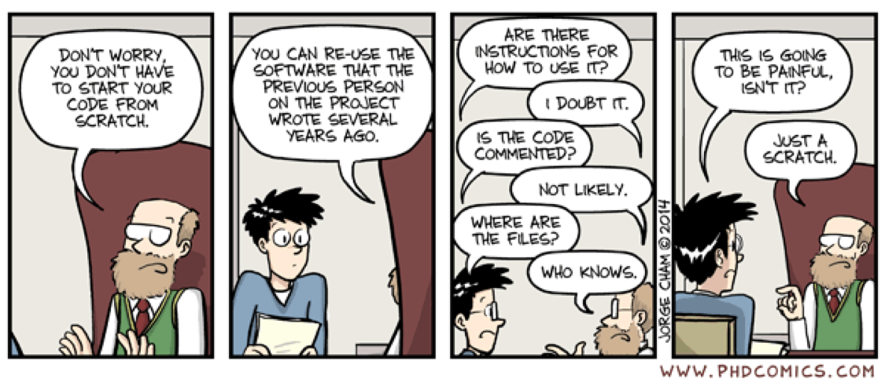

“Flow” in _bllflow_ refers to the process of using the Model Specification Worksheet to perform rountine data cleaning and transformation, performance reporting, and model deployment. Go to [`Workflow`](a_workflow.html) to see _bllflow_'s seven steps to analysing observational data. You can pick and choose to use any steps that 
fit your own workflow.

<div class="image">
  
  <div class="img_caption">
  <p>If only they used <b>bllflow</b></p>
  </div>
</div>

## Workflow vignettes
Tne [`Workflow`](a_workflow.html) vignettes use the `pbc` data available in the `suvival` package to [replicate](https://www.ncbi.nlm.nih.gov/pubmed/2737595) a survival model for people with primary biliary cirrhosis.  What is the `pbc` data? The name, description and other information is included in the metadata file! 

See [`Example 4 - Helper and utility functions`](i_helper_functions.html). 

## Example - Study exclusion criteria
A typical first step when starting a new study is applying inclusion and exclusion criteria to the study data. In our PBC survival model, we will include only participants ages 40 to 70 years.

There are two approaches to perform these exclusion criteria.

##### 1) Excluding participatns age < 40 or >70 years using `clean.Min()` and `clean.Max()`
```{r Load libraries, warning=TRUE, include=FALSE}
library(survival) # for pbc data
data(pbc)
library(bllFlow)

```
```{r Clean with general utility fuctions}
# TODO: cleanPBC <- clean.Min(pbc, age, min = 40)
# TODO: cleanPBC <- clean.Max(cleanPBC, age, max = 70)

# use print = TRUE for a log of how many participants were affected.
# clean.Min(pbc, age, min = 40, print = TRUE)
```

##### 2) Excluding participants using `BLLFLow()` and the Model Specification Worksheets
```{r Clean with BBLFlow()}
# read the MSW
variables <- read.csv(file.path(getwd(), '../inst/extdata/PBC/PBC-variables.csv'))
variableDetails <- read.csv(file.path(getwd(), '../inst/extdata/PBC/PBC-variableDetails.csv'))

# perform all data cleaning steps
pbcModel <-  BLLFlow(pbc, variables, variableDetails)
  cleanPbc <- clean.Min(pbcModel, print = TRUE)
  cleanPbc <- clean.Max(cleanPbc, print = TRUE)
```
Within the `PBC-variables.csv` file there is a column 'min' and 'max' and a row each variable. The 'age' variable has the values for 40 and 70 in the 'min' and 'max' columns. This example is shown in more detail in the [data cleaning and transformation](d_clean_data.Rmd) vignette. 

Note that executing `BLLClean.Max` executes `min` and `max` criteria for all variables in the pbcModel.
